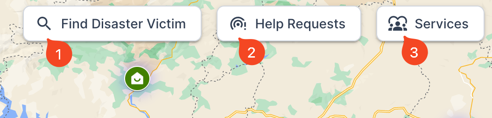
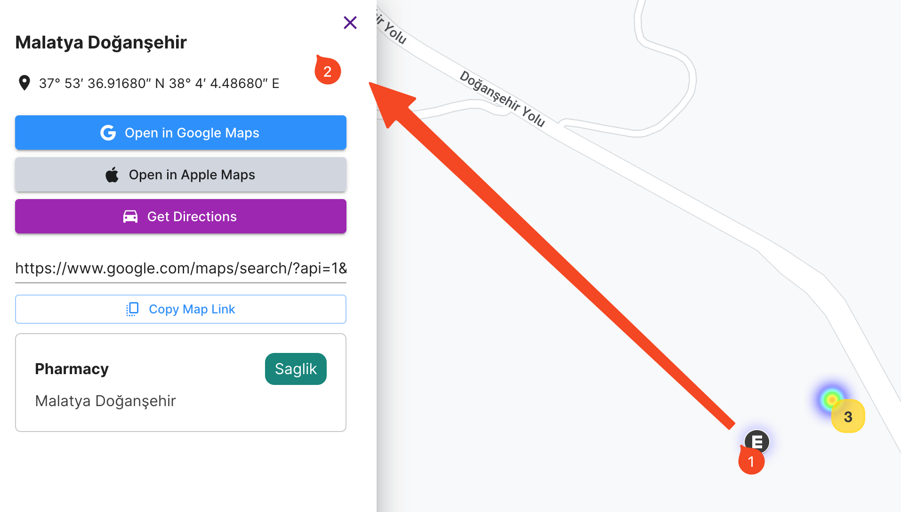

## What is Afet Harita

Afet Harita is an open-source web platform that aims to provide critical information and resources during disasters and emergencies. It is a collaborative effort between volunteers and professionals from the software industry who are committed to helping people in times of crisis.

At its core, Afet Harita is a tool that helps emergency responders and volunteers locate and assist those who are in need. It aggregates data from various sources such as social media, NGOs, and official government reports to provide real-time information about the situation on the ground.

Afet Harita is built on the principles of transparency, collaboration, and community-driven development. It is designed to be accessible to everyone, regardless of their technical expertise or resources. With its user-friendly interface and intuitive features, Afet Harita empowers users to take an active role in disaster response efforts.

Whether you are a first responder, a volunteer, or someone who needs help during a disaster, Afet Harita is here to support you. By providing critical information and resources, we hope to make a meaningful difference in people's lives during times of crisis.

## Who are our users?

1. **Disaster Victims:** People who have been affected by a natural disaster and are in need of relief aids such as food, water, shelter, medical assistance, etc.

2. **Rescue Teams & Relief Workers:** Individuals or organizations involved in providing assistance and aid to disaster victims such as search and rescue teams, medical professionals, NGOs, government agencies, etc.

3. **Volunteers:** People who are interested in volunteering their time and resources to help disaster victims and relief workers. They may want to donate money, supplies, or offer their services such as transportation, translation, or other forms of assistance.

4. **General Public:** People who are interested in staying informed about the disaster and the relief efforts, and want to help in any way they can. They may want to spread awareness about the disaster, donate money or supplies, or provide other forms of support.

## How to Use Afet Harita
> How-to guides, tutorials, user guides, FAQ, troubleshooting guides, API references

The Afet Harita application can be accessed through a web browser using the following URLs:

**Production version:** [https://afetharita.com](https://afetharita.com)

**Release candidate version:** [https://rc.afetharita.com](https://rc.afetharita.com)

The production version is the stable version of the application that is available to the public. The release candidate version is a pre-release version that is made available to users for testing purposes.

### Main Filters

Afet Harita provides three main filtering categories to help users find the information they need:

1. **Find Disaster Victims:** This category includes help and request calls that have been crawled via social media by our AI models, as well as validated records from stakeholders such as NGOs. Users can filter this category by location, type of request, and other relevant criteria to find the victims who need assistance.

2. **Help Request:** This category includes relief aid requests such as blankets, tents, and other supplies needed by victims of the disaster. Users can filter this category by location, type of request, and other relevant criteria to find the requests that match their capacity to help.

3. **Services:** This category includes information about services provided in the region to help the people affected by the disaster, such as food serving, hospitals, pharmacies, and other resources. Users can filter this category by location and type of service to find the services they need.

To filter the information in any of the above categories, users can use filter options provided on the Afet Harita homepage. The filtering options are intuitive and user-friendly, allowing users to easily narrow down their search criteria and find the relevant information they need.

If you need further assistance in using the filtering options, please refer to the help section of this user manual for guidance.

### Map Interface

Afet Harita's map interface is designed to make it easy for users to locate and access information about the disaster and its victims. When users select a filter category and apply their search criteria, the results will appear on the map as specific icons that correspond to the type of information displayed.

To view the detailed information for a particular map pin, users can simply click on the pin. This will open a new drawer on the left side of the screen that displays all the relevant information for that pin. The information may include the location of the disaster victim, the type of help they need, the contact information for the victim or the NGO providing assistance, and any other pertinent details.

The map interface is user-friendly and intuitive, allowing users to easily navigate and interact with the map to find the information they need. The interface also includes zoom and pan functions, allowing users to explore the map in more detail and focus on specific regions or locations.

If you have any questions or issues while using the map interface, please refer to the help section of this user manual for guidance.

## Timeline

The Afet Harita project has been developed over a period of several days/weeks, with the goal of providing a platform for disaster victims and aid providers to connect and collaborate. The project has faced many challenges and obstacles along the way, but the team has worked diligently to overcome these challenges and deliver a high-quality product that meets the needs of its users.

In this section, we will provide a timeline of the major milestones and events in the development of the Afet Harita platform. We will highlight some of the key challenges we faced, as well as the strategies we used to address them. We hope that this timeline will give readers a better understanding of the development process and the commitment and dedication that went into creating the Afet Harita platform.

You can find them in Eray Gündoğmuş's blog posts [How an Open-Source Disaster Map Helped Thousands of Earthquake Survivors: afetharita.com](https://dev.to/erayg/how-an-open-source-disaster-map-helped-thousands-of-earthquake-survivors-afetharitacom-440) and [What other teams did on Disaster Map in first 72 hours](https://dev.to/erayg/what-other-teams-did-on-afetharita-in-first-72-hours-26pg).

