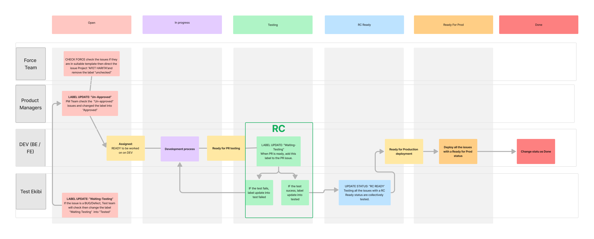

# Introduction

This onboarding document is designed to help you quickly understand what the project is about, how we build the product, how we manage tickets and issues, how we communicate, and where you can find important documents. Project Description

Afet Harita is an open-source community project that aims to help disaster victims by consolidating data for help on a map. The app is optimized for use on mobile devices, even in poor network conditions, and provides a map with detailed case locations and heatmaps. It provides information on rescue needs, relief aid requests, and confirmed cases in the field. The app also has a filter for time durations, such as last 30 minutes, last 60 minutes, and last 24 hours. Our target audience is disaster victims, their relatives, civil society organizations, and citizens. We believe that by working together, we can make a difference in the lives of those affected by disasters.

# Communication

We use [Discord](https://discord.gg/itdepremyardim) as our main communication platform. To join the open source community, you should have already joined the Discord Server first. This is the place where you can ask questions, discuss issues with other team members, and stay up to date on the latest developments. On the Discord, you can find various channels for the project, such as product, front-end, and back-end channels. We encourage you to use these channels to discuss your work, ask questions, and collaborate with the team. In addition to text-based communication, we also use voice channels for meetings, quick discussions, and sync-ups. This helps to keep the team connected and ensures that everyone is up-to-date on the latest developments.

If you thinking you need some permissions for specific role (i.e. if you do not see the relevant product channel, be sure to ask for the product permission via [#önbilgi](https://discord.com/channels/1072074800622739476/1072135955709952081) channel.
Here are the list of some popular Discord channels for the Afet Harita:

| Channel Name & Link | Derscription |
|:---:|:---:|
| #duyurular | Official announcments (both post and 15m Town Halls) |
| #önbilgi | Form Links & Permission request |
| #afet-harita-product-core | Core PM channel for Afet Harita product managers |
| #afet-harita-product | Afet Harita's channel for general product information. The same name  also applies to a voice channel that the product team uses as their  primary meeting channel. |
| #frontend | You can find and discuss any frontend specific topic in the channel |
| #afetharita-backend | You can find and discuss any backend specific topic in the channel |
| #tasarim-ux-ui | You can find and discuss any UI/UX specific topic in the channel |

# Ticket/Issue Management

To manage tickets and issues, we use GitHub Issues. When you encounter a bug, have a feature request, or want to propose an improvement, you can open a new issue in the GitHub repository. When you open an issue, be sure to include a clear and concise description of the problem, along with any relevant information, such as screenshots, code snippets, and error messages. Our team uses GitHub Projects to keep track of the progress of each issue and ensure that nothing falls through the cracks. If you are assigned to an issue, it's your responsibility to update the issue with your progress and let the team know when it's ready for review. You can the below table to access relevant repositories under the [Açık Kaynak GitHub organization](https://github.com/acikkaynak):

| Repo Name & Link | Description |
|:---:|:---:|
| deprem-yardim-frontend | Main Front-end Repo & Issues & Boards |
| deprem-yardim-backend | Main Back-end Repo & Issues & Boards |
| afetharita-roadmap | Product Tasks & Product Docs, & Meeting Notes |

## Issue Types

There are six types of issues in the afetharita-roadmap project, which is the main repo for product management.

| Issue Type | Description |
|:---:|:---:|
| Action | Management actions for PMs |
| Epic | Captures large, complex work across multiple user stories |
| Initiative | High-level strategic goals and desired impact |
| Task | Individual actions under user stories |
| User Story | Desired outcomes for specific stakeholders |
| Report a security vulnerability | To report any security concerns and/or vulnerabilities |

Each issue type has its own issue template which should be respected by the reporter to ensure the optimal standards by providing the required detail in the template.

# Issue Workflow

**Open:** This status is applied when a new issue is created and is still being evaluated by the check force team. The check force team reviews issues with the Open status and ensures that they meet our standards. They then remove the unchecked label from the issue. The product manager is also responsible for reviewing and approving Open issues by checking and validating the issue and adding the Approved label.

**In Progress:** When the PM approves an issue, it is assigned to an engineering team member and moved to the In Progress status. The engineering team member is responsible for making the necessary changes and updating the issue with their progress.

**Testing:** Once the development team has completed their work on an issue, they add the Waiting Testing label, and the test team moves the issue to the Testing status. The test team is responsible for reviewing and testing the development work. Once they have completed their testing, they change the label to Tested.

**Release Candidate:** If the test team finds that the development work meets our standards, they approve the issue and it is moved to the Release Candidate status.

**Ready for Production:** Release Candidate status indicates that the issue has been deemed ready for release by the development team.

**Done:** Finally, when the issue is ready to be deployed to production, it is moved to the Done status.

It is important to follow this workflow to ensure that our issues are properly tracked and managed and that we maintain high standards for our product development. If you have any questions or concerns, please don't hesitate to reach out to your team.

# Design

The product design team uses Figma as our main design tool. You can easily find both Desktop & Mobile designs in the below Figma links.

[Figma Design Link](https://www.figma.com/file/sctw6xtcdoFOfmE0gC97Ft/Afet-Harita---Afetharita.com?node-id=134%3A9010&t=uKRDgyHvTyTuB8iN-0)

